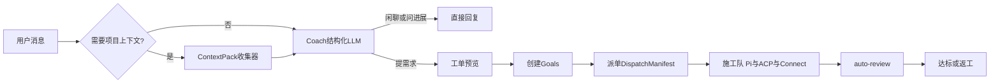

# OpenX 包工头架构改造路线图

## 愿景

OpenX 是一个**包工头（Foreman）**系统：对用户任务意图做**拆解 + 约束 + 思考**，按需收集项目上下文，最终把汇总后的工单（需求、约束、验收标准、项目上下文、Skill、MCP、Agent 角色）派给对应 CLI（施工队）执行，并监工、验收、返工。

## 现状审查摘要

### Coach 大脑层

- 单次 `generateObject` 结构化 JSON，无 tool-use 循环
- 上下文来自 Goal DB 摘要 + workspaceRoot 字符串，**不读盘**
- 意图分类仅靠 prompt 软引导 + 规则关键词兜底
- Executor 推荐在 Goal 创建层，chat 路径未闭环
- Skill 选择进入 prompt 文字；MCP/Agent 前端无效

关键文件：`packages/coach/src/service.ts`、`prompts.ts`、`apps/server/src/coach-context.ts`

### 调度 / 生命周期层

- Goal 状态机完整：draft → running → awaiting_review → done/failed/rework
- `dependsOn` 驱动子目标链式调度；`priority` 影响启动顺序
- auto-review 有 maxIterations 防死循环
- Pi/Connect watchdog 存在；ACP 无 watchdog
- 带子任务创建时 autoStart 仅启动主目标（与子任务批量创建行为不一致）

关键文件：`apps/server/src/orchestrator.ts`、`goal-actions.ts`、`auto-review.ts`

### 执行器层

- `buildExecutionPrompt` 未注入 `constraints` / `acceptance`
- ACP `mcpServers: []` 硬编码
- `listKnownExecutorIds` 产生 `acp:acp:*` 无效 id
- Connect 路径相对完整（SKILL.md 正文注入）

关键文件：`packages/executor-core/src/prompt.ts`、`packages/executor-acp/src/index.ts`

### Web 交互层

- MCP/Agent 选择仅存 localStorage，不进 API
- 工单预览不显示约束、不可编辑
- 推荐执行器需手动应用

关键文件：`apps/web/src/components/ChatPanel.tsx`、`RefinedPreviewCard.tsx`

## 差距清单

| # | 能力 | 状态 |
|---|------|------|
| 1 | 结构化意图分类 | 缺失 → P1 增加 CoachIntentSchema |
| 2 | 确定性项目上下文收集 | 缺失 → P1 ContextPack |
| 3 | 工单含约束/验收/executor | 部分 → P1 schema + P2 prompt |
| 4 | Skill/MCP/Agent 派单闭环 | 断裂 → P2 管线 + P3 UI |
| 5 | ACP mcpServers 传递 | 硬编码空 → P2 修复 |
| 6 | failed 重启 | canTransition 允许 → P1 确认 start 路由 |
| 7 | 项目/对话树 | 远期 P4 |

## 实施分期

### P1 契约层（WS0）

- `RefinedGoalSchema` 增 `executorId?`、`priority?`
- `RefinedSubGoalSchema` 增 `dependsOnIndex?`
- `CoachIntentSchema`、`ContextPackSchema`
- `CoachChatInputSchema` 增 `mcpIds?`、`agentId?`
- `McpServerConfigSchema`、`Settings.mcpServers`
- `ExecutorContext` 增 `mcpServers?`、`agentRole?`
- 修复 skills-resolve 双前缀 bug

### P2 并行开发

**WS1 Coach 大脑**：ContextPack 收集器、触发启发式、prompt 渲染、executor 推荐回填

**WS2 派单管线**：constraints/acceptance 进 prompt、MCP 注册表与 ACP 传递、agent 角色、autoStart 统一

**WS3 Web 工单体验**：预览可编辑、MCP/Agent 真实生效、设置页 MCP 管理

### P3 集成验证

- 全仓 typecheck + 测试
- 冒烟：聊天 → 上下文 → 预览 → 创建 → 执行

### P4 远期

- 项目/对话树（Codex 式）：projects / conversations 表
- 结构化验收报告、ACP watchdog
- 子任务全完成后父目标自动验收

## 验收标准

### WS0

- [ ] shared 导出所有新 schema，tsc 通过
- [ ] `listKnownExecutorIds` 不再产生 `acp:acp:*`
- [ ] failed 目标可通过 POST start 重启

### WS1

- [ ] 含「实现/修复/文件」类消息触发 ContextPack
- [ ] refined 缺 executorId 时服务端回填推荐
- [ ] mcpIds/agentId 进入 Coach 上下文

### WS2

- [ ] 执行 prompt 含验收标准与约束块
- [ ] ACP newSession/loadSession 收到非空 mcpServers（若已配置）
- [ ] 创建含 subGoals 且 autoStart 时子任务也启动

### WS3

- [ ] coachChat body 含 mcpIds、agentId
- [ ] 工单预览显示约束且可编辑
- [ ] 设置页可管理 MCP servers
