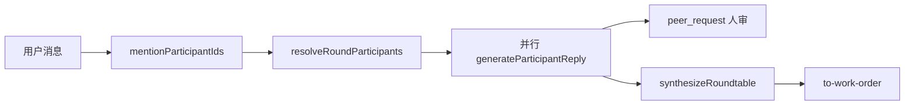

# 圆桌发言路由语义：AutoGen GroupChat → OpenX

> 用 AutoGen（及后继 Agent Framework）的 GroupChat 概念，对齐 OpenX `direct` / `diverge` /「自动选人」语义。  
> **实现锚点**：[`resolveRoundParticipants`](../packages/coach/src/roundtable/router.ts)、[`CreateChatRoundInput`](../packages/shared/src/roundtable.ts)、[`runChatRound`](../apps/server/src/roundtable-service.ts)  
> **不做**：引入 AutoGen/Crew 作为运行时依赖。

## 1. 概念对照总表

| AutoGen（AgentChat）概念 | OpenX 对应 | 说明 |
|--------------------------|------------|------|
| Participant / Agent | `ConversationParticipant`（绑定 `profileId` + `modelRef`） | 席位是会话级实例，不是全局单例 Agent |
| System message / role | `AiProfile.rolePrompt` | 画像职责；与模型解耦 |
| Group chat shared context | `buildHistoryText` + 每席 `generateParticipantReply` | 默认可共享历史；**diverge 同轮互不可见** |
| `RoundRobinGroupChat` | （未实现）可选「轮询」 | 见 §4 |
| `SelectorGroupChat`（LLM 选下一人） | （未实现）可选「自动主持」 | 见 §4；默认不做 |
| 用户指定下一说话人 | `@displayName` / `@全体` → `mentionParticipantIds` | 主路径 |
| `TextMentionTermination` | 无对等「说完 APPROVE 结束队」 | 圆桌轮次由并行完成/取消结束；任务闭环在 Goal |
| Human-in-the-loop | `peer_request` 待用户同意 | 比 Agent 互 @ 自动续跑更克制 |
| Team result / summary | `round_synthesis` + 可选 `to-work-order` | 工头总结 → 任务单 |
| Max turns | `ROUNDTABLE_MAX_PARALLEL_REPLIES`（6） | 限制的是**单轮并行路数**，不是多轮队内循环 |



---

## 2. OpenX 模式语义（已实现）

### 2.1 `mode: "direct"`（定向 / 常规）

| 条件 | `participantIds` | `synthesize` | 行为 |
|------|------------------|--------------|------|
| 无 `@` | 仅工头席 | `false` | 等价「单助手」工头答；仍走圆桌生成管线 |
| `@一人` 或多 `@` | 被点名的 enabled 席位（可含工头） | `false`（ChatPanel 当前固定） | **并行**各席独立生成 |
| `@全体` / `@all` | 所有 enabled **非工头** | `false` | 并行；超过 6 人 **报错**（不静默裁剪） |

对齐 AutoGen：接近「用户点名谁发言」+ 多人时 fan-out，**不是** RoundRobin 轮流。

**ChatPanel 现状**：圆桌发送固定 `mode: "direct"`、`synthesize: false`。独立圆桌面板时代的 diverge UI 已并入主 Chat 后尚未完整迁回 Composer。

### 2.2 `mode: "diverge"`（发散）

| 条件 | `participantIds` | 默认 `synthesize` | 行为 |
|------|------------------|-------------------|------|
| 有 `@` / `@全体` | 同 direct 选人规则 | `true`（可关） | 并行；历史可 `excludeRoundId` **盲答** |
| 无 `@` | 非工头前 `ROUNDTABLE_DEFAULT_PARALLEL_REPLIES`（3）人 | `true` | 「自动拉几个人发散」 |

对齐 AutoGen：接近「多 Agent 独立作答再汇总」；汇总方是工头 `synthesize`，不是 Selector 选出的下一人。

可选入参：`outputGoal`（ideas/plans/risks/…）、`length`（short/medium/long）→ 写入各席 system 附加指令。

### 2.3 与「自动选人」的边界（产品锁定）

| 策略名（文档用语） | AutoGen 类比 | OpenX | 状态 |
|--------------------|--------------|-------|------|
| 手动 / `@` 点名 | 用户指定 speaker | **默认主路径** | 已实现 |
| 发散默认阵容 | 固定取前 N 人 | diverge 无 `@` → 前 3 非工头 | 已实现 |
| 轮询 List | `RoundRobinGroupChat` | — | **未做**（可选） |
| Natural / Selector | `SelectorGroupChat` | LLM 选下一个谁说 | **明确不做默认**；仅可作实验开关 |

---

## 3. 路由伪代码（与实现一致）

```text
enabled = participants.filter(enabled)
foreman = enabled.find(profileId == foreman)
nonForeman = enabled.filter(not foreman)

if mode == direct AND mentions empty:
  return [foreman]   // 必须有工头

if "__all__" in mentions:
  selected = nonForeman
else:
  selected = resolve each mention id in enabled  // 静音/未知 → error

if mode == diverge AND selected empty:
  selected = nonForeman.slice(0, 3)

if selected empty → error
if selected.length > 6 → error   // 不静默截断
synthesize = input.synthesize ?? (mode == diverge)
```

实现文件：`packages/coach/src/roundtable/router.ts`。

---

## 4. 可选扩展（仅语义预留，非本迭代实现）

### 4.1 轮询（RoundRobin）

- **语义**：用户一条消息后，按 `sortOrder` 依次各说一句（共享可见上文）。  
- **与现网差异**：现网多人是 **并行同时**，不是依次。  
- **若做**：新 `ChatRoundMode` 或 `speakerPolicy: "round_robin"`，勿复用 diverge 盲答。

### 4.2 自动主持（Selector）

- **语义**：工头或专用 selector 模型根据上文选出下一位 `participantId`。  
- **风险**：与「人点名」冲突、成本与失控互问。  
- **建议**：仅实验；且 **不得**绕过 `peer_request` 人审。

### 4.3 终止条件

| AutoGen | OpenX 建议映射 |
|---------|----------------|
| MaxMessageTermination | 单轮并行上限 6；会话级可用「停止全部」 |
| TextMentionTermination | 不适用于施工派单；任务完成看 Goal 态机 |
| 外部 cancel | `cancelRoundtableReply` / `cancelActiveRoundtableRounds` |

---

## 5. 人审与互问（相对 AutoGen 的增强）

| 步骤 | 说明 |
|------|------|
| 席位工具 `request_peer_reply` | 请求另一席回答 |
| 无 session grant | 写入 `peer_request` + 气泡卡，等用户拒绝/同意/本会话同意 |
| 有 grant | 可 `auto_approved` 后直接触发生成 |
| 移出席位 | 清除相关 `peer_mention_grants` |

这对应 LangGraph 式 interrupt，**优于** AutoGen 默认同组无限互聊；文档与 UX 应继续强调「AI 互问需你点头」。

---

## 6. 和工头正式对话 / 施工层的分界

| 层 | 模式 | API |
|----|------|-----|
| 工头单聊 | `conversation.mode === "foreman"` | `POST /api/coach/chat` |
| 圆桌多席 | `mode === "roundtable"` | `POST /api/roundtable/.../chat/rounds` |
| 施工 | Goal + Executor | Pi / ACP / Connect… |

圆桌总结 `to-work-order` 可桥回 refine/任务单，**不**把 AutoGen Team 当成执行器。

---

## 7. 相关文档

- UX 差距清单：[roundtable-ux-gap-sillytavern-librechat.md](./roundtable-ux-gap-sillytavern-librechat.md)
- 产品总述：不引入外部多 Agent 框架作运行时（见仓库 `AGENTS.md` / 产品核心架构）
